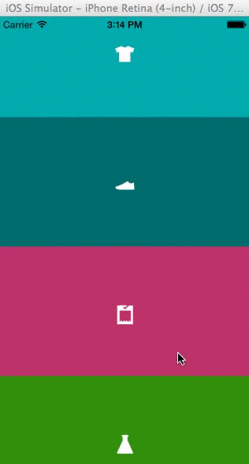
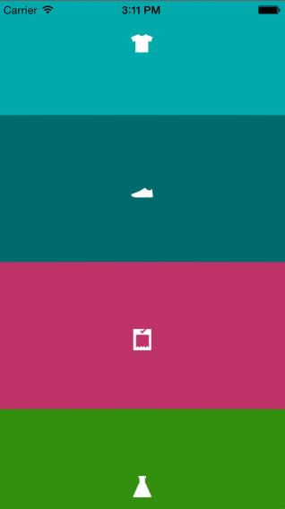

VPRubberMenu
============

UICollectionView - Menu component with 'rubbery' effect inspired by Nike 'Making' application.
*Created just for fun :)*

Usage
============
Use VPRubberLayout with your UICollectionView as UICollectionViewFlowLayout.
Use VPRubberCell as your UICollectionViewCell.
Use VPRubberSettings for configuring animation.

Authors
=======

**Vitaliy Popruzhenko**

+ http://lnkd.in/Ruy9XF
+ http://github.com/vitalykw

Credits
=======
+ Inspired by [https://itunes.apple.com/us/app/making-making-powered-by-nike/id662227880?mt=8](Making of Making Powered by NIKE MSI)

## License:
Licensed under the MIT license
